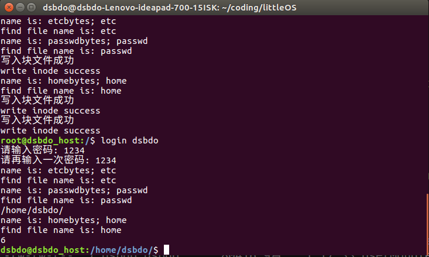
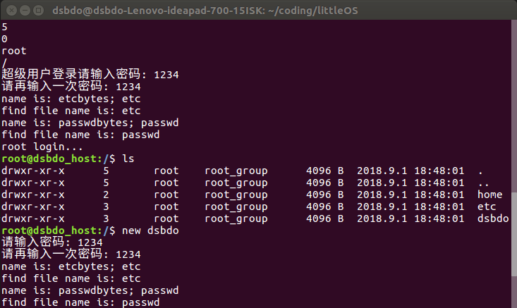

# littleOS
Do a personal operating system
项目开发大概用了6天的时间，因为没有仔细debug，其中bug很多，拿来玩一玩还是很不错的。

> 代码量统计如下,大概是2000行所有：

>

## 该项目是实现了一个仿Linux 的二级文件系统，实现思路如下：
1. 首先使用系统的dd命令创建一个大小为1G的空文件进行模拟磁盘；
2. 创建超级块superBlock，数据结构如下（其作用是系统启动时，加载进内存对文件系统进行识别）：
```
//声明superblock 数据结构
struct SuperBlock {
	//inode 数量 最多65536
	unsigned int s_Inode_num;
	//block number最多4294967294 
	unsigned int s_block_num;

    //原本是准备用于成组链接法，但因时间不足，就没有使用，基本没有作用
	unsigned int s_free_Inode_num;
	unsigned int s_free_block_num;
	int s_free_data_block_addr;
	int s_free[K_BLOCKS_PER_GROUP];
	
    //一个块大小
	unsigned int s_block_size;
    // Inode 项大小
	unsigned int s_Inode_size;
    //超级块大小
	unsigned int s_superblock_size;
    //每组多少块，成组链接法
	unsigned int s_blocks_per_group;
	

	//磁盘分布
	int s_superblock_startAddr;
	int s_InodeBitmap_startAddr;
	int s_blockBitmap_startAddr;
	int s_Inode_startAddr;
	int s_data_block_startAddr;
};
```

3. 创建Inode结构：
```
struct Inode {
	unsigned short i_Inode_num;
	unsigned short i_mode;//，确定了文件的类型，以及它的所有者、它的group、其它用户访问此文件的权限。
	unsigned short i_counter; //总共有几个目录项
	char i_uname[20];
	char i_gname[20];
	unsigned int i_size;//该Inode指向的文件大小，如果是文件的话
	
	time_t i_ctime; //Inode创建时间
	time_t i_mtime; //上一次修改Inode指向的文件的时间
	time_t i_atime; //最后一次访问Inode指向的文件的时间
	int i_dirBlock[12]; //这是inode直接指向的12 物理块， 也就是12*4 = 48 KB
	int i_indirBlock_1; //这是一级间接块，也就是用一个block来记录该文件剩下存储的block地址，一个地址4bytes， 所以是： 4KB / 4 * 4KB = 4M
	//合起来单个文件最大为 4096 + 48KB
};
```
4. 声明目录项：
```
struct DirItem {
    //目录名
	char itemName[K_MAX_NAME_SIZE];
    //该目录项的Inode地址
	int inode_addr;
};
```
5. 磁盘中的空闲块，与空闲Inode 采用位图的形式来进行管理
6. 磁盘的基本分布情况如下：
superBlock的内容 | Inode Bitmap | Block Bitmap | Inode  | data block

## 代码具体运行情况截图：
1. 初始化整个磁盘，在这个过程，经常出现文件读取权限的问题，所以建议先使用dd命令创建一个1G大小的空文件，然后文件命名为SystemDisk, 接着修改权限chmod 666 SystemDisk。该命令之后，需要输入两次1234， 作为root 用户登录密码，有想改的，可以自己到main.cpp 修改然后重新编译运行即可。
> 初始化效果图如下， 其中同时运行了help命令
>
2. 使用new user命令创建一个用户,该过程便是在/etc/passwd 目录下增加一条用户的记录，同时在/home/目录下，创建一个用户名的目录
> 创建用户结果图如下：
 
> 
 
3. 我们创建新用户之后，登录新用户,通过验证后，进入/home/user_name 的目录下
> 登录效果图如下：
 
>

4. 接着尝试的是创建目录的命令，我们先提前进入到/home/目录下，使用mkdir dir 创建一个新的目录
> 创建目录效果图如下：

>
5. 我们切换到新目录下，然后使用cd命令
> 切换目录效果如图：

>

6. 使用ls命令，打印当前目录下的所有目录项
> ls 命令如下，目前只能在ls 当前目录，不知ls dir的形式，效果图如下：

>

7. 创建目录成功后，我们使用rm 命令进行删除目录。
> rm 目录目前仅能删除目录，范围仅限当前目录下的一个目录，效果如图

>

8. 我们创建一个空文件，create file_name,该命令仅能用来创建一个空文件
>效果图如下：

>

9. 我们使用open 命令打开文件并以追加的形式写入文件（文件不存在便先创建文件）。open file_name < file_content。 同时我们测试read file_name 命令，也就是将一个文件进行读取，并将文件内容进行输出。
> 效果图如下：

>

10. 以覆盖的形式打开文件并写入， 文件不存在则先创建文件。open file << content
> open file << content 效果图如下：

> 

11. 最后一个命令是删除文件命令，del file_name
> del file_name 效果图如下：

>
